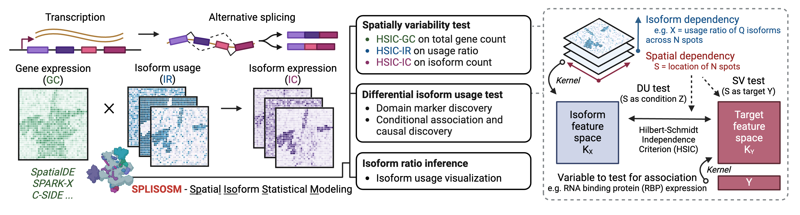

# SPLISOSM - Spatial Isoform Statistical Modeling



SPLISOSM (<u>SP</u>atia<u>L</u> <u>ISO</u>form <u>S</u>tatistical <u>M</u>odeling) is a Python package designed to analyze transcript usage patterns in spatial transcriptomics data. It provides a set of tools for hypothesis testing of spatial variability (SV) and differential isoform usage (DU). The package supports both non-parametric and parametric testing, with the latter using a multinomial linear mixed model (GLMM) to account for spatial correlation and covariate effects.

## Installation
Via GitHub (latest version):
```bash
pip install git+https://github.com/JiayuSuPKU/SPLISOSM.git#egg=splisosm
```

## Quick start
The SPLISOSM framework consists of two major steps:
1. **Spatial variability (SV) test**: Finding spatially variable transcript usage events from spatial transcriptomics data. 
2. **Differential usage (DU) test**: Testing the *conditional* association between isoform usage and spatial covariates such as spatial domains and expression of potential regulators (i.e. RNA binding proteins).

### Data preparation
The basic unit of SPLISOSM analysis is the isoform-level event, which can be a full-length transcript (i.e. from long-read) or a local variable structure from short-read. For conventional short-read spatial transcriptomics data, we use [Sierra](https://github.com/VCCRI/Sierra/tree/master) to extract transcriptome 3'end diversity (TREND) events *de novo*. See examples [here (Visium)](TODO) and [here (Slideseq-V2)](TODO).

SPLISOSM takes the following inputs:
1. `data`: (n_spot, n_event) Isoform-level expression quantification across spots. 
2. `event_anno`: (n_event, 2) For each isoform-level event, its `event_id` and `gene_id` (which gene it belongs to).
2. `coordinates`: (n_spot, 2) Spatial coordinates of spots.
3. (For DU test) `covariates`: (n_spot, n_covariate) Covariates to test for differential usage.

SPLISOSM is agnostic to event structure and thus does not distinguish between different types of isoform events (e.g. exon skipping, alternative 3'end, etc.). Both the SV and DU tests are *multivariate* and are performed at the gene level (i.e. **one test per gene**), integrating all events annotated to the same gene jointly to account for the compositional nature of isoform usage and to increase power.  

### Testing for spatial variability (SV)
SPLISOSM has three non-parametric SV tests for variability in different aspects:
1. **HSIC-GC**: spatial variability in *total gene expression*. This test is similar to [SPARK-X](https://genomebiology.biomedcentral.com/articles/10.1186/s13059-021-02404-0) but with a different spatial kernel design to increase the statistical power.
2. **HSIC-IR**: spatial variability in *isoform relative ratio*. Since isoforms of the same gene are interdependent, this test will simultaneously test variability in all Q isoforms of a gene (as a Q-dimensional sum-to-one vector). 
3. **HSIC-IC**: spatial variability in *isoform count*. This test is similar to HSIC-IR but uses isoform counts rather than relative ratios. Biologically, isoform expression variability is the joint result of variability in total gene expression and in isoform preference.

```python
from splisosm import SplisosmNP

# minimal input data
data = ... # list of length n_genes, each a (n_spots, n_isos) tensor
coordinates = ..., # (n_spots, 2), spatial coordinates
gene_names = ... # list of length n_genes, gene names

# initialize the model
model_np = SplisosmNP()
model_np.setup_data(data, coordinates, gene_names = gene_names)

# per-gene test for spatial variability
# method can be 'hsic-ir' (isoform ratio), 'hsic-ic' (isoform counts)
# 'hsic-gc' (gene counts), 'spark-x' (gene counts)
model_np.test_spatial_variability(
    method = "hsic-ir",
    ratio_transformation = 'none', # only applicable to 'hsic-ir', can be 'none', 'clr', 'ilr', 'alr', 'radial'
    nan_filling = 'mean', # how to fill NaN values in the data, can be 'mean' (global mean), 'none' (ignoring NaN spots)
)

# extract the per-gene test statistics
df_sv_res = model.get_formatted_test_results(test_type = 'sv')
```

### Testing for differential usage (DU)
#### Motivating example: Marker event discovery
One common utilities of DU testing is to identify "marker events" for categorical groups, e.g. cell-type-specific marker genes. In the context of spatial splicing, we can also define "marker isoform switching events", which is to test whether the isoform preference of a gene changes in different spatial domains. Naively, this can be done by combining isoform-level pairwise t-tests across isoforms.

```python
from splisosm import SplisosmNP

# minimal input data
# after running the SV test, keep only SVS genes for DU testing
data_svs = ... # list of length n_genes, each a (n_spots, n_isos) tensor
coordinates = ..., # (n_spots, 2), spatial coordinates
gene_names = ... # list of length n_genes, gene names

# here we also need the one-hot encoding of spatial domain membership
# covariates[i, j] = 1 if spot i belongs to domain j
covariates = ... # (n_spots, n_regions)
covariate_names = ... # list of length n_regions, domain names


# initialize the model with covariates
model_np = SplisosmNP()
model_np.setup_data(
    data_svs,
    coordinates,
    design_mtx = covariates,
    gene_names = gene_names,
    covariate_names = covariate_names
)

# run the pairwise t-test (one domain vs. all others) for each isoform,
# then combine the p-values using either Fisher's or Tippett's method to get gene-level p-values
model_np.test_differential_usage(
    method = "t-fisher", # can be "t-fisher", "t-tippett". 
    ratio_transformation = 'none', nan_filling = 'mean', # isoform ratio computing options
)

# per gene-factor pair test statistics
df_du_res = model.get_formatted_test_results(test_type = 'du')
```

However, t-test does not account for spatial autocorrelation and thus has inflated false positives (i.e. isoform usage ratio can form similar patterns by chance). This would be more problematic if the spatial domains are defined using unsupervised clustering. The double dipping problem. 

. This problem would be more prominent if 
To address this, we can use the HSIC-based DU test, which is more powerful and robust to noise.

#### DU test with continuous covariates


. To address this, we can use the HSIC-based DU test, which is more powerful and robust to noise.

 associated with spatial covariates. SPLISOSM provides both non-parametric and parametric tests for DU.

### Non-parametric testing using SplisosmNP
```python
# from splisosm.hyptest import IsoSDE # will be deprecated in the future
from splisosm.hyptest_np import SplisosmNP

# non-parametric testings
model_np = SplisosmNP()
model_np.setup_data(
    data, # list of length n_genes, each element is a (n_spots, n_isos) tensor
    coordinates, # (n_spots, 2), 2D array/tensor of spatial coordinates
    design_mtx = None, # (n_spots, n_covariates), 2D array/tensor of covariates
    gene_names = None, # list of length n_genes, gene names
    covariate_names = None # list of length n_covariates, covariate names
)
model_np.test_spatial_variability(
    method = "hsic-ir", # can be 'hsic-ir' (isoform ratio), 'hsic-ic' (isoform count), 'hsic-gc' (gene count), 'spark-x'
    ratio_transformation = 'none', # only applicable to 'hsic-ir', can be 'none', 'clr', 'ilr', 'alr', 'radial'
    nan_filling = 'mean', # how to fill NaN values in the data, can be 'mean' (global mean), 'none' (ignoring NaN spots)
    use_perm_null = False, n_perms_per_gene = None, # by default, use the asymptotic chi-sq mixture null
    return_results = False, print_progress = True
)
df_sv_res = model.get_formatted_test_results(test_type = 'sv') # per gene test statistics

model_np.test_differential_usage(
    method = "hsic-gp", # can be "hsic", "hsic-knn", "hsic-gp", "t-fisher", "t-tippett". See the function docstring for details.
    ratio_transformation = 'none', nan_filling = 'mean', # same as above
    hsic_eps = 1e-3, # regularization parameter kernel regression, only applicable to 'hsic'. If set to None, will be the unconditional HSIC test.
    gp_configs = None, # dictionary of configs for the Gaussian process regression, only applicable to 'hsic-gp'
    print_progress = True, return_results = False
)
df_du_res = model.get_formatted_test_results(test_type = 'du') # per gene-factor pair test statistics
```

### Parametric testing using SplisosmGLMM
```python
# from splisosm.hyptest import IsoSDE # will be deprecated in the future
from splisosm.hyptest_glmm import SplisosmGLMM

# parametric model fitting
model_p = SplisosmGLMM(
    model_type = 'glmm-full', # can be 'glmm-full', 'glmm-null', 'glm'
    share_variance: bool = True,
    var_parameterization_sigma_theta: bool = True,
    var_fix_sigma: bool = False,
    var_prior_model: str = "none",
    var_prior_model_params: dict = {},
    init_ratio: str = "observed",
    fitting_method: str = "joint_gd",
    fitting_configs: dict = {'max_epochs': -1}
)
model_p.setup_data(
    data, # list of length n_genes, each element is a (n_spots, n_isos) tensor
    coordinates, # (n_spots, 2), 2D array/tensor of spatial coordinates
    design_mtx = None, # (n_spots, n_covariates), 2D array/tensor of covariates
    gene_names = None, # list of length n_genes, gene names
    covariate_names = None # list of length n_covariates, covariate names
    group_gene_by_n_iso = False, # whether to group genes by the number of isoforms for batch processing
)
model_p.fit(
    n_jobs = 1, # number of cores to use
    batch_size = 1, # number of genes with the same number of isoforms to process in parallel per core
    quiet=True, print_progress=True,
    with_design_mtx = False, 
    from_null = False, refit_null = True, # for LLR test
    random_seed = None
)
model_p.save("model_p.pkl") # save the fitted model
per_gene_glmm_models = model_p.get_fitted_models() # list of length n_genes, each element is a fitted model

# differential usage testing
model_p.test_differential_usage(
    method = "score", # can be "wald", "score",
    print_progress = True, return_results = False
)
df_du_res = model_p.get_formatted_test_results(test_type = 'du') # per gene-factor pair test statistics

```


## Documentation
See the [documentation](TODO) for more details on the statistical models and the testing procedures.

<!-- ### The non-parametric model: HSIC-based tests

### The generative model: Multinomial linear mixed model (GLMM):

$$
\begin{aligned}
    Y_{s:} | \alpha_{s:} &\sim Multinomial(\sum_q Y_{sq}, \alpha_{s:}) \\
    \eta_{sq} := log(\frac{\alpha_{sq}}{\alpha_{sQ}}) &= X_{s:}\beta_q + \nu_q, q \in \{1, ..., Q-1\} \\
    \nu_q &\sim MVN(0, \sigma_q^2 (\theta_q \Sigma + (1 - \theta_q) I)) \\
\end{aligned}
$$

**Notations:** For a given gene to test, we have the following notations
1. $Y_{S \times Q} := \{y_{sq}\}$ is the expression matrix of observed counts of isoform q at spatial location s.
2. $\alpha_{S \times Q} := \{\alpha_{s:}\} = \{(\alpha_{s1}, ..., \alpha_{sQ})\}$ is the Q-simplex representing the expected isoform usage ratio at each location s.
3. $\eta_{S \times Q-1} := \{\eta_{:q}\} = \{(\eta_{1q}, ..., \eta_{Sq})\}$ is the set of logits modeled by a linear mixed model. 
4. $X_{S \times (M + 1)}$ is the design matrix of M covariates and the intercept bias term.
5. $\beta_{(M+1) \times (Q-1)}$ is the corresponding regression coefficient matrix.
6. $\nu_q$ is the spatial random effect term to be integrated out.
7. $\sigma_q$ is the overall variability, $\Sigma$ and is the structured spatial covariance, and $\theta_q$ is the proportion of the spatial covariance compared to unstructured white noise. 

An alternative parameterization of the Gaussian variance is also available by setting `'var_parameterization_sigma_theta' == False`:

$$
\nu_q \sim MVN(0, \sigma_{sp}^2 \Sigma + \sigma_{nsp}^2 I).
$$

Also, by default we set `'share_variance' == True` to use the same variance for all isoforms:

$$
\nu_q \sim MVN(0, \sigma^2 (\theta \Sigma + (1 - \theta) I))
$$

### Goals:
1. The DU test: Conditioned on the spatial covariance structure, test whether the isoform usage preference of a gene is associated with certain spatial covariates $X$ (domains, cell type abundances, distance to landmarks etc.). 
$$\mathcal{H}_1 : \beta \neq 0, \mathcal{H}_o : \beta = 0$$
2. Given noisy data with low sequencing depth, provide a more robust estimation of the isoform usage ratio.
$$\hat{\alpha} = f(Y, X, \Sigma)$$ -->