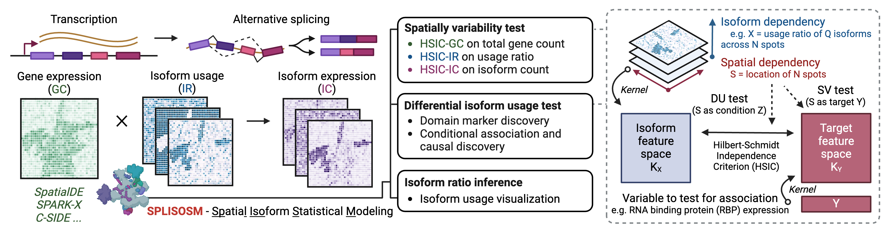

# SPLISOSM — Spatial Isoform Statistical Modeling

[](https://pypi.org/project/splisosm/)
[](https://github.com/JiayuSuPKU/SPLISOSM/blob/main/LICENSE)
[](https://splisosm.readthedocs.io/en/latest/)
[](https://pepy.tech/project/splisosm)

SPLISOSM (**SP**atia**L** **ISO**form **S**tatistical **M**odeling, pronounced *spliceosome*) is a Python package
for analyzing RNA-processing patterns in spatial transcriptomics (ST) data. It uses
multivariate, kernel-based association tests to detect:

1. **Spatial variability (SV)** of isoform usage, isoform expression, or gene expression
   across spatial locations; and
2. **Differential isoform usage (DU)** against spatial covariates such as region
   annotations or RNA-binding-protein (RBP) expression, optionally conditioned on
   spatial autocorrelation.



Built on the Hilbert–Schmidt Independence Criterion (HSIC), the tests are *multivariate*
— each gene is summarized by a single p-value aggregated across all of its isoforms — and
well-calibrated without permutation sampling.

## Supported platforms & feature types

SPLISOSM is platform-agnostic. Confirmed-compatible data types include:

| Data type              | Example platforms                                      | Feature                         |
| ---------------------- | ------------------------------------------------------ | ------------------------------- |
| Long-read ST           | 10x Visium / Visium HD + ONT                           | Full-length transcript isoform  |
| Short-read 3′ ST       | 10x Visium / Visium HD (fresh-frozen), Slide-seqV2     | TREND peak (alt. polyadenylation) |
| Short-read targeted ST | 10x Visium (CytAssist) / Visium HD FFPE, Flex          | Exon/junction probe usage       |
| In situ targeted ST    | 10x Xenium Prime 5K, 10x Atera                         | Codeword (exon/junction probe)  |

SPLISOSM does **not** perform isoform quantification itself. See the
[Feature Quantification guide](https://splisosm.readthedocs.io/en/latest/txquant.html)
for per-platform preprocessing recipes and loaders in `splisosm.io`.

## Choosing a model class

SPLISOSM exposes three entry-point classes with a shared
`setup_data → test_* → get_formatted_test_results` lifecycle:

| Class            | Best for                                                 | Input            | SV     | DU  |
| ---------------- | -------------------------------------------------------- | ---------------- | ------ | --- |
| `SplisosmNP`     | Any geometry (irregular spots, single cells, segmented)  | `AnnData`        | ✓      | ✓   |
| `SplisosmFFT`    | Regular grids (Visium HD, Xenium binned) — fastest       | `SpatialData`    | ✓      | ✓   |
| `SplisosmGLMM`   | Parametric effect sizes via multinomial GLM/GLMM         | `AnnData`        | ⚠️ *   | ✓   |

*SplisosmGLMM is calibrated for DU testing only; its SV test is conservative.

Decision tree:

```
Is your data on a REGULAR GRID (Visium HD, Xenium binned, etc.)?
├── YES →  SplisosmFFT  (fastest; requires SpatialData input)
└── NO  →  Interested in parametric effect sizes?
          ├── YES →  SplisosmGLMM  (GLM/GLMM; DU only)
          └── NO  →  SplisosmNP    (recommended default)
```

## Installation

```bash
# stable release from PyPI
pip install splisosm

# or latest from GitHub
pip install git+https://github.com/JiayuSuPKU/SPLISOSM.git#egg=splisosm
```

Optional extras:

```bash
# SpatialData input support for SplisosmFFT, plus gpytorch/FINUFFT GP backends for DU
pip install "splisosm[sdata,gp]"
```

## Quick start

```python
from splisosm import SplisosmNP

model = SplisosmNP()
model.setup_data(
    adata,                         # AnnData of shape (n_spots, n_isoforms)
    spatial_key="spatial",         # adata.obsm key for coordinates
    layer="counts",                # raw isoform counts
    group_iso_by="gene_symbol",    # adata.var column grouping isoforms → gene
)

# Spatial variability of isoform usage (SVP genes)
model.test_spatial_variability(method="hsic-ir")
df_sv = model.get_formatted_test_results("sv", with_gene_summary=True)

# Differential usage vs. a covariate matrix (e.g. RBP expression), conditioned on space
model.setup_data(
    adata, spatial_key="spatial", layer="counts", group_iso_by="gene_symbol",
    design_mtx=covariates, covariate_names=cov_names,
    skip_spatial_kernel=True,      # DU-only: no CAR kernel needed
)
model.test_differential_usage(method="hsic-gp")
df_du = model.get_formatted_test_results("du")
```

SPLISOSM works with non-spatial / single-cell data too: pass `adj_key` pointing to an
`adata.obsp[...]` neighborhood graph (e.g. `"connectivities"` from
`scanpy.pp.neighbors`) in place of `spatial_key`.

For gene-level spatial variability as a drop-in for [SPARK-X](https://xzhoulab.github.io/SPARK/) or Moran's I:

```python
from splisosm.utils import run_hsic_gc
res = run_hsic_gc(gene_counts, coordinates)     # or run_hsic_gc(adata=adata, spatial_key="spatial")
```

See the [Quick Start](https://splisosm.readthedocs.io/en/latest/quickstart.html) for the
full-defaults reference and [Statistical Methods](https://splisosm.readthedocs.io/en/latest/methods.html)
for the underlying HSIC framework, CAR kernel, cumulant null approximations, GP backends, and the GLMM parametric alternative.

## Documentation & tutorials

- Documentation: https://splisosm.readthedocs.io/
- Tutorial gallery: long-read (SiT, Visium-HD ONT), short-read 3′ (Visium HD, Slide-seq),
  FFPE probe (Visium / Visium HD), in situ codeword (Xenium Prime 5K, segmented
  single-cell).
- Paper-companion code and analyses:
  https://github.com/JiayuSuPKU/SPLISOSM_paper
- Interactive visualization of spatial transcript diversity in mouse and human brain:
  * Adult mouse brain (Visium, Visium + ONT, Xenium Prime 5K): [Open Google Colab](https://colab.research.google.com/github/JiayuSuPKU/SPLISOSM_paper/blob/main/colab/sp_tx_diversity_mouse_cbs.ipynb).
  * Human DLPFC and glioma samples (Visium, Visium + ONT): [Open Google Colab](https://colab.research.google.com/github/JiayuSuPKU/SPLISOSM_paper/blob/main/colab/sp_tx_diversity_human.ipynb).

## Change log
See the [changelog](./CHANGELOG.md) for detailed release notes.

## Reporting issues

Please file bugs and feature requests on the
[GitHub Issues page](https://github.com/JiayuSuPKU/SPLISOSM/issues).

## References

`SplisosmNP` and `SplisosmGLMM` are described in

> Su, Jiayu, et al. “Mapping isoforms and regulatory mechanisms from spatial
> transcriptomics data with SPLISOSM.” *Nature Biotechnology* (2026): 1–12.
>
> [link to paper](https://www.nature.com/articles/s41587-025-02965-6)


The FFT-based acceleration of `SplisosmFFT` is described in

> Su, Jiayu, et al. "On the consistent and scalable detection of spatial patterns."
> arXiv preprint arXiv:2602.02825 (2026).
>
> [link to preprint](https://arxiv.org/abs/2602.02825)
