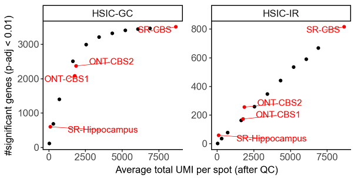

Frequently Asked Questions
==========================

Installation
--------------------
Please report any installation issues on the `GitHub Issues page <https://github.com/JiayuSuPKU/SPLISOSM/issues>`_.

Running SPLISOSM
--------------------

**1. I am not interested in isoform-level analysis. Can I use SPLISOSM for gene-level spatial variability testing?**

  Yes. The gene-level spatial variability test, *HSIC-GC*, is also available as a standalone function, :func:`splisosm.utils.run_hsic_gc`. 
  It can be used as a drop-in replacement for other spatial gene expression analysis tools like SPARK-X.

  .. code-block:: python

    from splisosm.utils import run_hsic_gc
    import numpy as np

    # gene expression matrix: (n_spot, n_gene)
    gene_counts = np.random.randn(100, 50)

    # spatial coordinates: (n_spot, 2)
    coordinates = np.random.rand(100, 2)

    # run HSIC-GC test
    # set approx_rank to an integer to enable low-rank approximation for large datasets
    test_results = run_hsic_gc(gene_counts, coordinates, approx_rank=None)
    print(test_results['statistic']) # test statistics, (n_gene,)
    print(test_results['pvalue']) # p-values, (n_gene,)

**2. Can I run SPLISOSM on single-cell spatial transcriptomics data?**

  Yes. SPLISOSM is applicable to both spot-based and single-cell resolution spatial transcriptomics data, as long as isoform-level quantifications are available. 
  For single-cell data, the spatial coordinates correspond to cell centroids instead of spot centers. See the :doc:`Isoform Quantification page <txquant>` for guidance on preparing input data.

**3. Can I run SPLISOSM on a subset of cells/spots instead of the whole tissue?**

  Yes. SPLISOSM can be run on any subset of cells or spots. This is useful when focusing on specific regions of interest or cell types. Simply filter your AnnData object to the subset of interest before passing it to SPLISOSM. 
  However, if your selection consists of disconnected regions, the spatial relationships might be distorted. To preserve the original global spatial context, you can use the full dataset to build the spatial kernel. 
  A simple way to achieve this is to prepare an input matrix containing all spots but set the isoform counts for unselected spots to zero. 
  SPLISOSM will then ignore these spots in the statistical tests while still using their coordinates to build the spatial kernel.

**4. Can I run SPLISOSM on single-cell non-spatial transcriptomics data?**

  Yes. While SPLISOSM is designed to identify patterns associated with physical spatial coordinates, it is technically possible to run it on non-spatial single-cell RNA-seq data. 
  This can be done by treating cell embeddings (e.g., PCA or UMAP coordinates) as "pseudo-spatial coordinates."
  However, this approach should be used with caution. The resulting 'spatial' patterns are only as meaningful as the biological relationships captured by the embedding. 
  Furthermore, be aware of potential circularity if the isoform data was used to generate the embeddings in the first place, as this could lead to spurious associations.

**5. Which differential usage test method should I use: parametric or non-parametric?**

  We recommend using the non-parametric test (:class:`splisosm.hyptest_np.SplisosmNP` with ``method='hsic-gp'``) as the default choice. It is more robust to model misspecification and generally provides better control of the false positive rate.
  The parametric test (:class:`splisosm.hyptest.SplisosmGLMM`) allows for the inclusion of covariates and confounders, which can be useful in specific experimental designs.

  Note that both conditional tests ('hsic-gp' and 'glmm') are computationally intensive and may take hours to run on large datasets. The faster unconditional tests ('hsic' or 'glm') do not account for spatial autocorrelation in the null model, which can lead to inflated p-values. 
  They may be suitable for exploratory analyses where speed is a priority.

  .. code-block:: python

    from splisosm.hyptest_np import SplisosmNP
    from splisosm.hyptest import SplisosmGLMM

    # non-parametric DU test (unconditional)
    model_np = SplisosmNP()
    model_np.setup_data(data_svs, coordinates, design_mtx=covariates, gene_names=gene_svs_names, covariate_names=covariate_names)
    # the unconditional test is equivalent to the multivariate correlation coefficient test
    model_np.test_differential_usage(method='hsic', hsic_eps=None)

    # parametric DU test using GLM (unconditional)
    model_glm = SplisosmGLMM(model_type = 'glm')
    model_glm.setup_data(data_svs, coordinates, design_mtx=covariates, gene_names=gene_svs_names, covariate_names=covariate_names)
    model_glm.fit()
    model_glm.test_differential_usage(method='score')

Interpretation of Results
--------------------------

**6. For genes with spatially variable RNA processing (SVP), can I tell which isoforms are driving the spatial variability?**

  Yes and no. Isoform usage ratios are compositional, meaning they sum to one for each gene in a given spot or cell. If one isoform's usage increases in a spatial region, the usage of one or more other isoforms must decrease. For this reason, SPLISOSM's primary differential usage test (HSIC-IR) is a gene-level multivariate test that aggregates signals across all of a gene's isoforms.

  However, for genes with more than two isoforms, it is possible to rank the isoforms by their individual contributions to the overall spatial pattern. This can be done by computing a separate univariate spatial variability statistic (e.g., HSIC) for each isoform's usage ratio.

  .. code-block:: python

    from splisosm.utils import counts_to_ratios, run_hsic_gc
    import numpy as np

    # example data
    data = np.random.rand(100, 3)  # (n_spot, n_iso), isoform expression matrix for a gene with 3 isoforms
    data[data < 0] = 0  # ensure non-negative values

    # compute isoform ratios
    data = counts_to_ratios(data, transformation='none', nan_filling='mean') # (n_spot, n_iso)
    coordinates = np.random.rand(100, 2)  # (n_spot, 2), spatial coordinates

    # compute per-isoform univariate HSIC test using HSIC-GC
    sv_results = run_hsic_gc(data, coordinates) # dict with 'statistic' and 'pvalue' for each isoform

    # rank isoforms by their HSIC test results
    ranked_isoform_indices = np.argsort(sv_results['pvalue'])  # ascending order

.. note::

  This per-isoform ranking is for exploratory purposes only. The adjusted p-values from this analysis should not be considered as formal hypothesis testing, as the usage ratios of isoforms from the same gene are inherently correlated.

**7. How many spatially variably expressed (SVE) genes or spatially variably processed (SVP) genes should I expect to find?**

  The number of detected SVE/SVP genes depends on many factors, including the biological system, data quality, and sequencing depth. 
  For example, in our analyses of the adult mouse brain, the number of detected SVP genes did not saturate at the sequencing depths tested. 
  We observed that the number of detected SVP genes increased linearly as sequencing depth rose to ~8,000 UMIs per Visium spot.

  .. _faq:umi-depth:

   **Number of significant genes versus sequencing depth in down-sampling experiments.**
   Each black dot represents a short-read Visium coronal brain section (CBS) sample down-sampled to specific depth. 
   ONT-CBS1 and ONT-CBS2 are two long-read SiT (Visium-ONT) CBS samples.
   SR-Hippocampus: Slide-seqV2 hippocampus sample with higher spatial resolution but fewer UMI per spot.
  
**8. I have finished running SPLISOSM, what should I do next?**

  After obtaining the test results from SPLISOSM, you can perform various downstream analyses to gain further biological insights. Examples include:

  - Visualizing the spatial expression and usage patterns of top SVE/SVP genes.
  - Clustering spots or genes based on isoform usage profiles to identify spatial domains or co-regulated gene modules.
  - Performing Gene Ontology (GO) enrichment analysis on SVE/SVP gene lists to identify enriched biological processes.
  - Conducting motif enrichment analysis on the sequences of SVP genes/isoforms to identify potential regulatory elements.
  - Validating predicted associations between SVP genes and RNA-binding proteins (RBPs) using external data (e.g., from CLIP-seq databases like `POSTAR3 <http://111.198.139.65/RBP.html>`_) or functional perturbation experiments.

  Example analyses from the SPLISOSM manuscript are available in the `SPLISOSM Paper GitHub Repository <https://github.com/JiayuSuPKU/SPLISOSM_paper/>`_.

