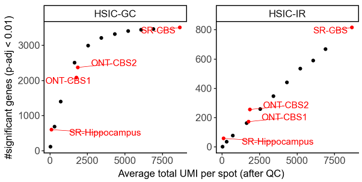

Frequently Asked Questions
==========================

Installation
--------------------
Please report any installation issues on the `GitHub Issues page <https://github.com/JiayuSuPKU/SPLISOSM/issues>`_.

Platform compatibility
------------------------
**1. Which spatial transcriptomics platforms are supported by SPLISOSM?**

  SPLISOSM is designed to be platform-agnostic and can be applied to data from any spatial transcriptomics technology, as long as isoform-level quantification is available.
  We have confirmed that the following platforms generate data that can be directly analyzed by SPLISOSM:

  - Short-read: 10x Visium (FFPE, 3'), 10x Visium HD (FFPE, 3'), Slide-seqV2.
  - Long-read: 10x Visium ONT, 10x Visium HD ONT.
  - In situ: 10x Xenium Prime 5K.

  See the :doc:`Feature Quantification page <txquant>` for guidance on preparing input data from different platforms, and 
  the :doc:`Tutorial Gallery <tutorials/gallery>` for example analyses.

**2. I am not interested in isoform-level analysis. Can I use SPLISOSM for gene-level spatial variability testing?**

  Yes. The gene-level spatial variability test, *HSIC-GC*, is also available as a standalone function, :func:`splisosm.utils.run_hsic_gc`.
  It can be used as a drop-in replacement for other spatial gene expression analysis tools like SPARK-X.

  .. code-block:: python

    from splisosm.utils import run_hsic_gc
    import numpy as np

    # ── matrix mode ──────────────────────────────────────────────────
    # gene expression matrix: (n_spot, n_gene)
    gene_counts = np.random.randn(100, 50)

    # spatial coordinates: (n_spot, 2)
    coordinates = np.random.rand(100, 2)

    # run HSIC-GC test (default: Liu's eigenvalue method for the null)
    test_results = run_hsic_gc(gene_counts, coordinates)
    print(test_results['statistic'])  # test statistics, (n_gene,)
    print(test_results['pvalue'])     # p-values, (n_gene,)

    # moment-matching normal approximation (faster, no eigendecomposition)
    test_results = run_hsic_gc(gene_counts, coordinates, null_method="trace")

    # cap eigenvalue rank for large n (auto-capped at ceil(sqrt(n)*4) when n > 5000)
    test_results = run_hsic_gc(
        gene_counts, coordinates, null_configs={"approx_rank": 100}
    )

    # ── AnnData mode ─────────────────────────────────────────────────
    # adata.X or adata.layers[layer] must be a (n_spots, n_genes) count
    # matrix (dense or scipy sparse); adata.obsm[spatial_key] provides
    # spatial coordinates.
    test_results = run_hsic_gc(
        adata=adata,       # AnnData of shape (n_spots, n_genes)
        layer=None,        # None → use adata.X; str → use adata.layers[layer]
        spatial_key="spatial",
        min_counts=1,      # optional: drop genes with fewer total counts
        min_bin_pct=0.05,  # optional: drop genes expressed in < 5% of spots
    )

Choosing a model class
---------------------------------

**3. What is the difference between SplisosmNP, SplisosmFFT, and SplisosmGLMM?**

  SPLISOSM provides three model classes, each targeting a different use case:

  - :class:`~splisosm.SplisosmNP` — **non-parametric HSIC tests** using a sparse CAR spatial kernel.
    Supports both SV and DU testing, works on arbitrary geometries (irregular spots, single cells,
    segmented tissue), and accepts ``AnnData`` or raw tensor inputs.
    *Recommended default for most datasets.*

  - :class:`~splisosm.SplisosmFFT` — **FFT-accelerated HSIC tests** on **regular grids** (Visium HD,
    Xenium binned data). Shares the same statistical model as :class:`~splisosm.SplisosmNP` but
    exploits the translation invariance of regular lattices to perform convolutions in Fourier space.
    Accepts a ``SpatialData`` object as input. *Recommended for large regular-grid datasets for
    fast computation and lower memory footprint.*

  - :class:`~splisosm.SplisosmGLMM` — **parametric multinomial GLMM** with a Gaussian random field
    spatial random effect. **Supports DU testing only**. Potentially more interpretable 
    (effect sizes, confidence intervals etc.) but requires
    fitting a model per gene, which is computationally intensive.
    *Use when you need effect-size estimates.*

  See :doc:`Quick Start <quickstart>` for a model-selection decision tree.

**4. Why SplisosmNP and SplisosmFFT give different results?**

  While sharing the same statistical methodology, p-values from the two classes
  can differ for three reasons:

  1. **Periodic boundary assumption.**
  :class:`~splisosm.SplisosmFFT` treats the grid as periodic (block-circulant kernel), which means bins at
  opposite edges of the grid are treated as spatial neighbours. 
  In contrast, :class:`~splisosm.SplisosmNP` builds a k-NN graph from the actual coordinates and has no wrap-around. 
  Note that in most cases, the tissue does not occupy the entire grid; the periodic assumption
  holds since the boundary bins are mostly unobserved (zero-padded).

  2. **Rasterisation and zero-padding.**
  :class:`~splisosm.SplisosmFFT` operates on the full :math:`H \times W` raster grid.  Unobserved bins
  (positions absent in the ``sdata.tables`` AnnData) are zero-padded (as if they had zero counts). 
  :class:`~splisosm.SplisosmNP` operates only on the :math:`n \le H \times W` observed spots recorded in the AnnData, 
  so the effective sample size and kernel matrix dimensions can differ.

  3. **SplisosmNP low-rank approximation.**
  For large datasets, :class:`~splisosm.SplisosmNP` approximates the kernel with a low-rank eigen-decomposition,
  which can lead to slightly different p-values compared to the full-rank version. 
  The approximation rank is controlled via ``null_configs={"approx_rank": r}``, with default :math:`r = \lceil 4\sqrt{n} \rceil` when :math:`n > 5000`.

  In practice, when the grid is densely observed (few missing bins) and the tissue is far
  from the grid boundary, the two classes give very similar results. 
  When low-rank approximation is used, :class:`~splisosm.SplisosmNP` loses sensitivity for high-frequency patterns in favor of higher power for low-frequency patterns.
  This is a design trade-off.

**5. Which differential usage test method should I use: parametric or non-parametric?**

  We recommend using the non-parametric test (:class:`~splisosm.hyptest_np.SplisosmNP` with ``method='hsic-gp'``) as the default choice. It is more robust to model misspecification and generally provides better control of the false positive rate.
  The parametric test (:class:`~splisosm.hyptest_glmm.SplisosmGLMM`) allows for the inclusion of covariates and confounders, which can be useful in specific experimental designs.

  Note that both conditional tests (``'hsic-gp'`` and ``'glmm'``) are computationally intensive and may take hours to run on large datasets. 
  For ``'hsic-gp'``, inducing-point approximations and GPU acceleration (via the `gpytorch` backend) are available.
  For ``'glmm'``, model fitting is handled natively with PyTorch with GPU device support, and low-rank kernel approximation is also available (via ``SplisosmGLMM(approx_rank=...)``).

  .. code-block:: python

    from splisosm.hyptest_np import SplisosmNP

    model_np = SplisosmNP()
    model_np.setup_data(...)
    model_np.test_differential_usage(
        method="hsic-gp", 
        residualize="cov_only",
        # inducing point approximation for faster GP fitting
        gpr_configs={"covariate": {"n_inducing": 1000}}
    )

  Alternatively, consider the faster unconditional tests (``'hsic'`` or ``'glm'``). While they do not account for spatial autocorrelation and may lead to inflated p-values,
  the overall ranking of gene-covariate associations is often similar to the conditional tests, especially for top hits.

  .. code-block:: python

    from splisosm.hyptest_np import SplisosmNP
    from splisosm.hyptest_glmm import SplisosmGLMM

    # non-parametric DU test (unconditional)
    model_np = SplisosmNP()
    model_np.setup_data(...)
    # the unconditional test is equivalent to the multivariate correlation coefficient test
    model_np.test_differential_usage(method='hsic')

    # parametric DU test using GLM (unconditional)
    model_glm = SplisosmGLMM(model_type='glm')
    model_glm.setup_data(...)
    model_glm.fit()
    model_glm.test_differential_usage(method='score')

Running SPLISOSM
--------------------

**6. Can I run SPLISOSM on single-cell spatial transcriptomics data?**

  Yes. See the :doc:`Feature Quantification page <txquant>` for guidance on preparing input data from Space Ranger and Xenium Ranger segmentation outputs.

**7. Can I run SPLISOSM on a subset of cells/spots instead of the whole tissue?**

  Yes. SPLISOSM can be run on any subset of cells or spots. This is useful when focusing on specific regions of interest or cell types. 
  Simply filter your AnnData object to the subset of interest before passing it to SPLISOSM. 
  However, if your selection consists of disconnected regions, the spatial relationships might be distorted. 
  To preserve the original global spatial context, you can use the full dataset to build the spatial kernel. 
  A simple way to achieve this is to prepare an input matrix containing all spots but set the isoform counts for unselected spots to zero. 
  SPLISOSM will then ignore these spots in the statistical tests while still using their coordinates to build the spatial kernel.

**8. Can I run SPLISOSM on single-cell non-spatial transcriptomics data?**

  Yes. While SPLISOSM is designed to identify patterns associated with physical spatial coordinates, it is technically possible to run it on non-spatial single-cell RNA-seq data.
  This can be done by treating cell embeddings (e.g., PCA or UMAP coordinates) as "pseudo-spatial coordinates."
  :class:`~splisosm.SplisosmNP` natively supports high-dimensional coordinate arrays (any number of dimensions ≥ 2) — simply pass the PCA embedding matrix as the ``spatial_key`` 
  (or a pre-computed graph adjacency matrix, such as ``adata.obsp['connectivities']`` as the ``adj_key``) in ``setup_data``.

  This approach should be used with caution: 'spatial' patterns in this case are only as meaningful as the biological relationships captured by the embedding.
  Furthermore, be aware of potential circularity if the isoform data was used to generate the embeddings, as this may lead to spurious associations.

Interpretation of Results
--------------------------

**9. For genes with spatially variable RNA processing (SVP), can I tell which isoforms are driving the spatial variability?**

  Yes and no. Isoform usage ratios are compositional, meaning they sum to one for each gene in a given spot or cell. If one isoform's usage increases in a spatial region, the usage of one or more other isoforms must decrease. For this reason, SPLISOSM's primary differential usage test (HSIC-IR) is a gene-level multivariate test that aggregates signals across all of a gene's isoforms.

  However, for genes with more than two isoforms, it is possible to rank the isoforms by their individual contributions to the overall spatial pattern. This can be done by computing a separate univariate spatial variability statistic (e.g., HSIC) for each isoform's usage ratio.

  .. code-block:: python

    from splisosm.utils import counts_to_ratios, run_hsic_gc
    import numpy as np

    # example data
    data = np.random.rand(100, 3)  # (n_spot, n_iso), isoform expression matrix for a gene with 3 isoforms
    data[data < 0] = 0  # ensure non-negative values

    # compute isoform ratios
    data = counts_to_ratios(data, transformation='none', nan_filling='mean') # (n_spot, n_iso)
    coordinates = np.random.rand(100, 2)  # (n_spot, 2), spatial coordinates

    # compute per-isoform univariate HSIC test using HSIC-GC
    sv_results = run_hsic_gc(data, coordinates) # dict with 'statistic' and 'pvalue' for each isoform

    # rank isoforms by their HSIC test results
    ranked_isoform_indices = np.argsort(sv_results['pvalue'])  # ascending order

.. note::

   This per-isoform ranking is for exploratory purposes only. The adjusted p-values from this analysis should not be considered as formal hypothesis testing, as the usage ratios of isoforms from the same gene are inherently correlated.

**10. How many spatially variably expressed (SVE) genes or spatially variably processed (SVP) genes should I expect to find?**

  The number of detected SVE/SVP genes depends on many factors, including the biological system, data quality, and sequencing depth. 
  For example, in our analyses of the adult mouse brain (Visium + ONT and Visium 3'), the number of detected SVP genes did not saturate at the sequencing depths tested. 
  We observed that the number of detected SVP genes increased linearly as sequencing depth rose to ~8,000 UMIs per Visium spot.

  .. _faq:umi-depth:

   **Number of significant genes versus sequencing depth in down-sampling experiments.**
   Each black dot represents a short-read Visium coronal brain section (CBS) sample down-sampled to specific depth. 
   ONT-CBS1 and ONT-CBS2 are two long-read SiT (Visium-ONT) CBS samples.
   SR-Hippocampus: Slide-seqV2 hippocampus sample with higher spatial resolution but fewer UMIs per spot.
  
**11. I have finished running SPLISOSM, what should I do next?**

  After obtaining the test results from SPLISOSM, you can perform various downstream analyses to gain further biological insights. Examples include:

  - Visualizing the spatial expression and usage patterns of top SVE/SVP genes.
  - Clustering spots or genes based on isoform usage profiles to identify spatial domains or co-regulated gene modules.
  - Performing Gene Ontology (GO) enrichment analysis on SVE/SVP gene lists to identify enriched biological processes.
  - Conducting motif enrichment analysis on the sequences of SVP genes/isoforms to identify potential regulatory elements.
  - Validating predicted associations between SVP genes and RNA-binding proteins (RBPs) using external data (e.g., from CLIP-seq databases like `POSTAR3 <http://111.198.139.65/RBP.html>`_) or functional perturbation experiments.

  Example analyses from the SPLISOSM manuscript are available in the `SPLISOSM Paper GitHub Repository <https://github.com/JiayuSuPKU/SPLISOSM_paper/>`_.

