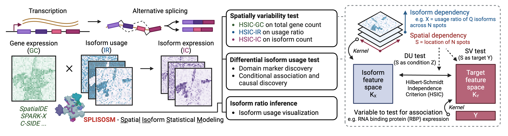

Welcome
=======

.. toctree::
   :maxdepth: 2
   :hidden:
   :caption: Getting Started

   self
   installation
   quickstart
   txquant
   faq

.. toctree::
   :maxdepth: 2
   :hidden:
   :caption: Tutorials

   tutorials/gallery

.. toctree::
   :maxdepth: 2
   :hidden:
   :caption: API Reference

   autoapi/splisosm/index

`SPLISOSM (SPatiaL ISOform Statistical Modeling) <https://github.com/JiayuSuPKU/splisosm>`_ is a Python package
for analyzing RNA isoform patterns in spatial transcriptomics (ST) data. It employs multivariate kernel association tests to detect (i) *spatial variability* in
isoform usage across spatial locations, and (ii) *differential association* between isoform usage and spatial covariates such as region annotation and RNA binding protein (RBP) expression.

Towards isoform-level spatial transcriptomics analysis
----------------------------------------------------------------
In the associated paper (`SPLISOSM 2025 <https://www.biorxiv.org/content/10.1101/2025.05.02.651907v2>`_) we show that major ST platforms,
including short-read-based `10x Visium <https://www.10xgenomics.com/products/hd-3-prime-gene-expression>`_ and imaging-based `10x Xenium Prime 5K <https://www.10xgenomics.com/products/xenium-5k-panel>`_,
contain sufficient isoform-level information for spatial pattern discovery. These isoform-level signals can be quantified at varying resolutions:

- Full-length isoform from long-read data
- Transcript 3' end diversity (TREND) event from short-read data
- Exon/junction probe (codeword) usage from imaging-based in situ data

.. list-table::
   :header-rows: 1
   :align: center
   :widths: 50 33 17

   * - Full-length isoform (long-read)
     - TREND event (short-read)
     - Codeword (in situ)
   * - .. image:: ../img/Gnas.jpg
         :alt: ONT-Gnas
         :align: center
         :height: 110px
     - .. image:: ../img/Gnao1.jpg
         :alt: SR-Gnao1
         :align: center
         :height: 110px
     - .. image:: ../img/Trp53bp1.jpg
         :alt: IB-Trp53bp1
         :align: center
         :height: 110px

.. note::

  SPLISOSM does not perform isoform quantification itself. See the :doc:`Isoform Quantification page <txquant>` for guidance on preparing input data for different platforms.

Unlike conventional gene-centric spatial analysis, SPLISOSM focuses on patterns of RNA processing (e.g., alternative splicing, alternative polyadenylation) manifested at the isoform level.
Given isoform quantifications, SPLISOSM supports two types of statistical analyses:

- **Spatial variability (SV)**: Detect spatially variable transcript usage (*HSIC-IR*), transcript expression (*HSIC-IC*) or gene expression (*HSIC-GC*). Genes are termed *spatially variably processed (SVP)* if their HSIC-IR test results are significant; Genes are termed *spatially variably expressed (SVE)* if their HSIC-GC test results are significant.
- **Differential isoform usage (DU)**: Test the *conditional* association between transcript usage and spatial covariates, such as spatial domains and expression of potential regulators like RBPs.

.. note::

  These tests are *multivariate*, aggregating signals across all isoforms of a gene. That is, we evaluate whether the *joint distribution* of
  isoform quantities varies across space (SV) or is associated with covariates (DU), yielding one test per gene or per gene-covariate pair.

Building on the `Hilbert-Schmidt Independence Criterion (HSIC) <https://www.gatsby.ucl.ac.uk/~gretton/papers/GreBouSmoSch05.pdf>`_ framework for kernel-based association testing, 
SPLISOSM achieves provably higher statistical power in sparse data while delivering well-calibrated, permutation-free p-values. 
For methodological details, please refer to the self-contained Supplementary Notes of the `SPLISOSM paper <https://www.biorxiv.org/content/10.1101/2025.05.02.651907v2>`_.

.. image:: ../img/splisosm_method.jpg
   :alt: Method
   :width: 800

Reference
---------

Su, Jiayu, et al. "A computational framework for mapping isoform landscape and regulatory mechanisms from spatial transcriptomics data." bioRxiv (2025): 2025-05. `link to preprint <https://www.biorxiv.org/content/10.1101/2025.05.02.651907v1>`_

Frequently Asked Questions
--------------------------
Please refer to the :doc:`FAQ page <faq>` for answers to common questions regarding installation and usage.

Reporting issues
----------------

If you encounter any issues during installation or usage, please report them on the `GitHub Issues page <https://github.com/JiayuSuPKU/SPLISOSM/issues>`_.
